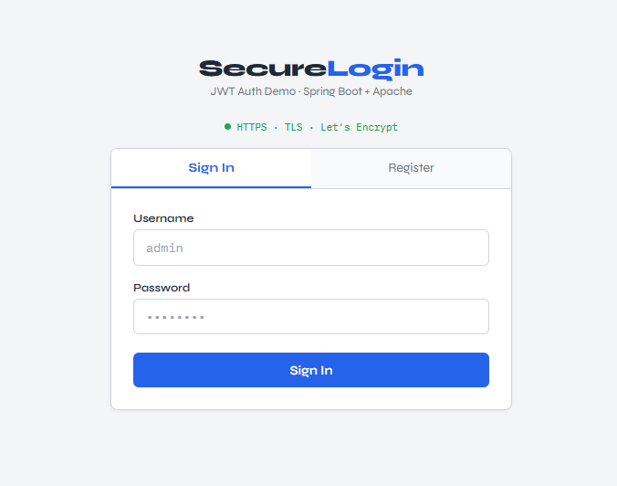
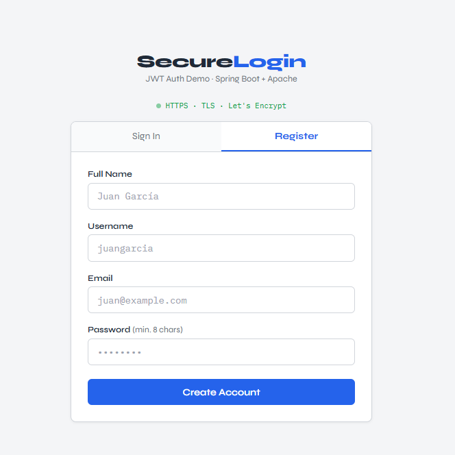
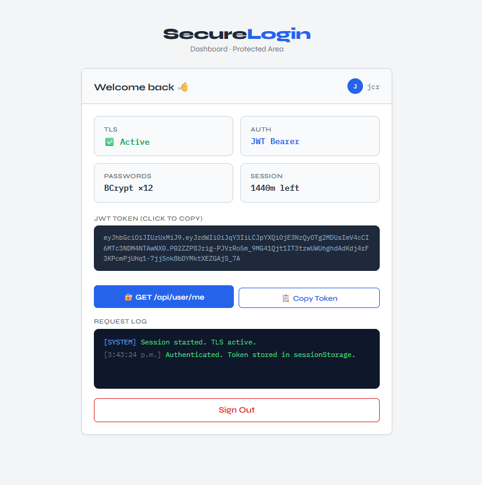
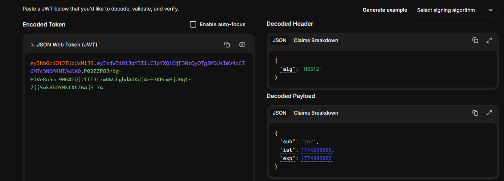

# 🔒 Secure Application Design
**Enterprise Architecture Workshop — TDSE**

Aplicación web segura con autenticación JWT desplegada en AWS EC2 usando Docker. Apache actúa como reverse proxy con TLS (Let's Encrypt), Spring Boot maneja la API REST y PostgreSQL almacena contraseñas hasheadas con BCrypt.


**🌐 Demo en vivo:** [https://apacheecijcr.duckdns.org](https://apacheecijcr.duckdns.org)

---

## 📐 Arquitectura

```
Browser (HTTPS :443)
       │
       ▼
┌──────────────────────────────────────────────────────┐
│  EC2 — Amazon Linux 2023                             │
│  apacheecijcr.duckdns.org                            │
│                                                      │
│  ┌──────────────┐  Docker bridge  ┌───────────────┐  │
│  │ login_apache │ ─── /api/* ───► │ login_service │  │
│  │ httpd:2.4    │    (HTTP:8080)  │ Spring Boot   │  │
│  │ Puerto 80/443│                 │ (expose only) │  │
│  │ TLS offload  │                 └───────┬───────┘  │
│  └──────────────┘                         │          │
│         │ sirve                           │ JDBC     │
│   frontend/index.html              ┌──────▼───────┐  │
│                                    │ login_postgres│  │
│                                    │ PostgreSQL 16 │  │
│                                    │ (expose only) │  │
│                                    └──────────────┘  │
└──────────────────────────────────────────────────────┘
```

**Flujo de una petición login:**
1. Browser → HTTPS :443 → Apache (TLS termination con Let's Encrypt)
2. Apache → HTTP :8080 → Spring Boot (`login-service`) vía Docker bridge
3. Spring → verifica BCrypt hash en PostgreSQL
4. Spring → genera JWT firmado → Apache → Browser

---

## 📁 Estructura del Proyecto

```
securelogin/
├── Dockerfile                           # Multi-stage build (Java 21)
├── docker-compose.yml                   # Dev local (H2 o PostgreSQL)
├── docker-compose.prod.yml              # Producción AWS (TLS activo)
├── pom.xml
├── .env.example                         # Plantilla — copia como .env
├── .gitignore
├── README.md
├── ARCHITECTURE.md                      # Documento de arquitectura detallado
├── frontend/
│   └── index.html                       # Cliente async HTML+JS (fetch/async/await)
└── src/main/
    ├── java/com/securelogin/
    │   ├── SecureloginApplication.java
    │   ├── config/
    │   │   ├── SecurityConfig.java      # Spring Security + JWT filter + CORS
    │   │   └── GlobalExceptionHandler.java
    │   ├── controller/
    │   │   ├── AuthController.java      # POST /api/auth/register  /login
    │   │   └── UserController.java      # GET  /api/user/me (protegido)
    │   ├── dto/
    │   │   ├── request/LoginRequest.java
    │   │   ├── request/RegisterRequest.java
    │   │   └── response/AuthResponse.java
    │   │   └── response/MessageResponse.java
    │   ├── model/User.java              # username, email, password (BCrypt), fullName
    │   ├── repository/UserRepository.java
    │   ├── security/
    │   │   ├── JwtUtils.java            # Genera y valida JWT (HMAC-SHA256)
    │   │   ├── JwtAuthFilter.java       # Filtro OncePerRequestFilter
    │   │   └── UserDetailsServiceImpl.java
    │   └── service/AuthService.java     # BCrypt + lastLogin timestamp
    └── resources/
        ├── application.properties
        └── apache/
            ├── httpd.local.conf         # Dev — sin SSL, proxy a Spring
            └── httpd.prod.conf          # Prod — TLS + security headers
```

---

## 🔑 Características de Seguridad

### BCrypt (cost factor 12)
Las contraseñas **nunca** se guardan en texto plano. Se hashean con BCrypt antes de persistir:
```java
// AuthService.java
password(passwordEncoder.encode(req.getPassword()))  // BCrypt hash
// BCryptPasswordEncoder.matches() lo verifica internamente en login
```

### JWT Stateless
- Firmado con HMAC-SHA256
- Expira en 24 horas (configurable vía `JWT_EXPIRATION_MS`)
- Sin sesión en el servidor → escalable horizontalmente
- Validado en cada request por `JwtAuthFilter`

### TLS Offloading
Apache termina HTTPS con certificados Let's Encrypt y reenvía a Spring Boot por HTTP interno. La gestión de certificados queda completamente fuera de la capa de aplicación.

### Secretos en variables de entorno
Ningún secreto está en el código fuente ni en las imágenes Docker. Todo se inyecta desde el archivo `.env` en tiempo de ejecución.

### Cabeceras HTTP de Seguridad
```
Strict-Transport-Security: max-age=63072000; includeSubDomains; preload
X-Frame-Options: DENY
X-Content-Type-Options: nosniff
X-XSS-Protection: 1; mode=block
Referrer-Policy: strict-origin-when-cross-origin
Permissions-Policy: geolocation=(), microphone=(), camera=()
```

---

## 🚀 Despliegue Local (desarrollo)

### Opción A — Sin Docker (H2 en memoria)
```bash
git clone https://github.com/davidcastiblanco/secure-login-aws.git
cd secure-login-aws
mvn spring-boot:run
# API disponible en http://localhost:8080
# H2 Console: http://localhost:8080/h2-console
```

### Opción B — Con Docker Compose
```bash
# 1. Crear el archivo .env
cp .env.example .env
# Editar .env con tus valores

# 2. Levantar todos los servicios
docker compose up --build -d

# App disponible en http://localhost
```

---

## ☁️ Despliegue en AWS EC2

### Paso 1 — Crear instancia EC2

1. AWS Console → **EC2 → Launch Instance**
2. AMI: **Amazon Linux 2023**, Tipo: `t3.micro`
3. **Security Group — Inbound rules:**

| Puerto | Protocolo | Fuente | Descripción |
|--------|-----------|--------|-------------|
| 22 | TCP | Tu IP | SSH admin |
| 80 | TCP | 0.0.0.0/0 | HTTP → redirect HTTPS |
| 443 | TCP | 0.0.0.0/0 | HTTPS (aplicación) |

### Paso 2 — Preparar el entorno

```bash
# Conectar por SSH
ssh -i "tu-clave.pem" ec2-user@<IP_EC2>

# Instalar Docker + Docker Compose
sudo dnf update -y
sudo dnf install -y docker git unzip python3-pip
sudo systemctl enable --now docker
sudo usermod -aG docker ec2-user

sudo mkdir -p /usr/local/lib/docker/cli-plugins
sudo curl -SL https://github.com/docker/compose/releases/latest/download/docker-compose-linux-x86_64 \
  -o /usr/local/lib/docker/cli-plugins/docker-compose
sudo chmod +x /usr/local/lib/docker/cli-plugins/docker-compose
```

### Paso 3 — Subir el proyecto

Desde tu PC:
```bash
scp -i "tu-clave.pem" secure-login-aws.zip ec2-user@<IP_EC2>:~/
```

En la EC2:
```bash
unzip secure-login-aws.zip && cd secure-app
cp .env.example .env
nano .env
```

Contenido del `.env`:
```bash
DB_NAME=logindb
DB_USER=loginuser
DB_PASSWORD=una_password_segura

# Generar con: openssl rand -hex 64
JWT_SECRET=pega_aqui_el_resultado

JWT_EXPIRATION_MS=86400000
CORS_ALLOWED_ORIGINS=https://TU_DOMINIO
```

### Paso 4 — Certificado TLS con Let's Encrypt

```bash
# Parar cualquier proceso en el puerto 80
sudo systemctl stop httpd 2>/dev/null

# Obtener certificado
sudo pip3 install certbot
sudo certbot certonly --standalone \
  -d TU_DOMINIO \
  --email tu@email.com \
  --agree-tos \
  --non-interactive
```

> **Tip:** Puedes usar [sslip.io](https://sslip.io) como dominio gratuito sin registro. Si tu IP es `1.2.3.4`, el dominio es automáticamente `1-2-3-4.sslip.io`.

### Paso 5 — Levantar en producción

```bash
# Actualizar dominio en Apache
sed -i 's/yourdomain.duckdns.org/TU_DOMINIO/g' \
  src/main/resources/apache/httpd.prod.conf

# Permisos a los certificados
sudo chmod 755 /etc/letsencrypt/live
sudo chmod 755 /etc/letsencrypt/archive

# Levantar
docker compose -f docker-compose.prod.yml up --build -d

# Verificar
docker compose -f docker-compose.prod.yml ps
```

### Paso 6 — Verificar

```bash
curl -X POST https://TU_DOMINIO/api/auth/register \
  -H "Content-Type: application/json" \
  -d '{"username":"test","email":"test@test.com","password":"Test1234!","fullName":"Test"}'
# Respuesta: {"message":"User registered successfully."}
```

---

## 📡 API Endpoints

| Método | Endpoint | Auth | Descripción |
|--------|----------|------|-------------|
| POST | `/api/auth/register` | No | Registrar usuario (BCrypt hash) |
| POST | `/api/auth/login` | No | Login → JWT token |
| GET | `/api/user/me` | JWT | Verificar sesión activa |

### Ejemplos

**Registro:**
```json
POST /api/auth/register
{ "username": "david", "email": "david@mail.com", "password": "pass1234", "fullName": "David Castiblanco" }

200 OK → { "message": "User registered successfully." }
400    → { "password": "size must be between 8 and 72" }
```

**Login:**
```json
POST /api/auth/login
{ "username": "david", "password": "pass1234" }

200 OK → { "token": "eyJhbGci...", "tokenType": "Bearer", "expiresIn": 86400000 }
401    → { "message": "Invalid username or password." }
```

**Endpoint protegido:**
```
GET /api/user/me
Authorization: Bearer eyJhbGci...

200 OK → token válido
403    → token ausente, expirado o inválido
```

---

## 🐛 Solución de Problemas

**Ver logs:**
```bash
docker compose -f docker-compose.prod.yml logs -f login-service
docker compose -f docker-compose.prod.yml logs -f apache
```

**Puerto 80 ocupado al correr Certbot:**
```bash
sudo lsof -i :80
sudo systemctl stop httpd
```

**Reiniciar un contenedor:**
```bash
docker compose -f docker-compose.prod.yml restart apache
```

---

## 👨‍💻 Autor

**Julian David Castiblanco Real**  
Escuela Colombiana de Ingeniería Julio Garavito — 2026

---
Evidencias:




